# MotoGP Manager - Paddock Tycoon: Technical & Gameplay Documentation

Welcome to the comprehensive technical, operational, and architectural documentation suite for **MotoGP Manager - Paddock Tycoon**, a deep motorcycle racing team management and incremental tycoon simulation built with modern web standards.

---

## 🗂️ Documentation Structure

The documentation is organized across three primary directories:

```
docs/
├── modules/          # Subsystem deep dives, formulas, and technical guides
├── issues/           # Known issues, architectural limitations, and technical debt
├── enhancements/     # Prospective features, technical roadmaps, and expansions
└── README.md         # Master index (this file)
```

---

## 📦 1. Core Modules Directory (`docs/modules/`)

Comprehensive technical documentation for each subsystem of the codebase:

| Document | Module Name | Core Topics Covered |
| :--- | :--- | :--- |
| **[01. Architecture & Engine](modules/01-architecture-and-engine.md)** | Core Architecture | Game loop (`TickEngine`), state management (`GameStateStore`), save persistence (`SaveManager`), offline progress calculation, and environment configuration (`env.js`). |
| **[02. Economy & Garage](modules/02-economy-and-garage.md)** | Economy & Hardware | 8 Production facilities (`PRODUCERS`), exponential cost math, passive/manual income, multiplier stacking, and bike hardware metrics (`BikeSystem`). |
| **[03. Research & Tech Tree](modules/03-research-and-tech-tree.md)** | R&D Engineering | 30+ Tech nodes across Powertrain, Aerodynamics, Unified ECU, and Factory Storage with prerequisite trees, costs, and mechanical effects. |
| **[04. Riders & Paddock Staff](modules/04-riders-and-paddock-staff.md)** | Personnel & Healthcare | 70+ Official riders (Moto3, Moto2, MotoGP), dynamic form, circuit affinity, 6-condition injury engine, reserve wildcards, and pit crew hiring. |
| **[05. Calendar & Season Schedule](modules/05-calendar-and-season-schedule.md)** | Calendar & Agenda | 22 Official Grand Prix rounds, testing weeks, day-by-day progression, sequential locking, mandatory session gating, and developer rewind tooling. |
| **[06. Pre-Season Testing & Long-Run Sim](modules/06-preseason-testing-and-longrun-sim.md)** | Testing & Telemetry | Sepang pre-season shakedowns, Prototype A vs B selection, 20-lap race distance simulations, thermal tire wear, fuel curves, and pit wall radio debriefs. |
| **[07. Race Weekend & Track Radar](modules/07-race-weekend-and-track-radar.md)** | Racing & GPS Radar | Official FIM weekend stages (FP1, PR, Q1, Q2, Sprint, Race), live lap simulation loop, FIM flags, interactive race choices, and 22 circuit 2D SVG GPS radar maps. |
| **[08. Promotion & Prestige](modules/08-promotion-and-prestige.md)** | Progression & Legacy | Category promotion criteria (Moto3 -> Moto2 -> MotoGP), prize money scaling, Heritage Token rebirth math, and permanent prestige perks. |
| **[09. UI & Views](modules/09-ui-and-views.md)** | Frontend & Presentation | Flicker-free reactive DOM rendering architecture, navigation tabs, bottom agenda drawer, live race control, and interactive modal screens. |

---

## ⚠️ 2. Known Issues & Technical Debt (`docs/issues/`)

Identified bugs, game-breaking exploits, race simulation edge cases, and architectural technical debt:

| Issue ID | Document | Severity | Summary |
| :--- | :--- | :---: | :--- |
| **ISSUE-01** | **[Paddock State Persistence](issues/paddock-state-persistence.md)** | Medium | AI competitor injuries and form reside on `window._motogpPaddockState` instead of inside `gameState.state`, causing AI medical data to reset upon browser reload. |
| **ISSUE-02** | **[LocalStorage Quota & Concurrency](issues/storage-quota-and-lap-history.md)** | Low | Unbounded `lapHistory` growth risks 5MB browser storage quotas over long careers; multi-tab write concurrency risks. |
| **ISSUE-03** | **[Race Simulation Edge Cases](issues/race-simulation-edge-cases.md)** | Low | Red flag restart synchronization when weather changes, and mobile SVG radar scaling on narrow viewports. |
| **ISSUE-04** | **[Round Index & Calendar Desynchronization](issues/round-index-calendar-desync.md)** | High | `CalendarSystem` sets `currentGPRound` instead of canonical `currentGPIndex`, causing calendar race launches to load outdated tracks. |
| **ISSUE-05** | **[Sprint Finish NaN Corruption](issues/sprint-finish-nan-corruption.md)** | Critical | `finishSprintRace` evaluates `undefined * 0.25` in Moto3/Moto2, turning `state.cash` permanently into `NaN` and corrupting the save game. |
| **ISSUE-06** | **[Red Flag Quick Restart Tire Wipe](issues/red-flag-restart-tire-wipe.md)** | High | Red flag quick restart sets `rs.tireCondition = 100` but fails to reset user entry in `rs.leaderboard`, causing fresh tires to be wiped back to old wear on the next lap. |
| **ISSUE-07** | **[Pre-Season & Long-Run Sim Reward Exploit](issues/preseason-and-longrun-reward-exploit.md)** | High | Lack of idempotency checks allows players to repeatedly click confirmation/accept buttons for infinite Telemetry, RP, and Hype. |
| **ISSUE-08** | **[Promotion Hub 10Hz DOM Thrashing](issues/promotion-hub-dom-thrashing.md)** | Medium | `renderPromotionHub()` ignores `forceRebuild`, wiping `innerHTML` and reattaching click handlers 10 times a second, causing dropped clicks and GC churn. |
| **ISSUE-09** | **[Floating-Point Resource Lockout](issues/floating-point-resource-lockout.md)** | Medium | IEEE 754 precision accumulation leaves resources at `49.999999999998`. Strict `< 50` checks reject purchases despite the UI displaying `50 / 50`. |
| **ISSUE-10** | **[Category Promotion Calendar Desync](issues/promotion-calendar-desync.md)** | High | `promoteTeam()` resets `currentGPIndex = 0` but leaves calendar week and activity completions at end-of-season, breaking pre-season and schedule alignment. |
| **ISSUE-11** | **[Unbounded Rider Skill Scaling](issues/unbounded-rider-skill-scaling.md)** | Medium | Rider skill upgrades lack a 99/100 ceiling, allowing stats to reach 150+, breaking UI progress bar widths past 100% and warping race simulation pace. |
| **ISSUE-12** | **[Detached SVG Path Angle Calculation](issues/detached-svg-path-angle-nan.md)** | Medium | Unmounted SVG path elements return 0 length in WebKit/headless contexts, leading to `0 % 0 = NaN` tangent calculations and broken bike map markers. |
| **ISSUE-13** | **[Junior Data Analyst Lore Discrepancy](issues/producer-lore-discrepancy.md)** | Low | Flavor text states Junior Data Analyst "Consumes 0.5 Telemetry/s", but the economy loop generates RP passively without requiring or consuming Telemetry. |

---

## 🚀 3. Future Enhancements & Roadmap (`docs/enhancements/`)

Forward-looking technical expansions and feature proposals:

| Enhancement ID | Document | Impact | Summary |
| :--- | :--- | :---: | :--- |
| **ENH-01** | **[Canvas Telemetry & Tire Heatmaps](enhancements/telemetry-canvas-and-tire-heatmaps.md)** | High | Real-time HTML5 2D Canvas trace oscilloscope (Speed, Throttle, Brake, Lean Angle) and 3-zone tire thermal heatmaps. |
| **ENH-02** | **[Rider Contracts & Junior Academy](enhancements/junior-academy-and-contracts.md)** | High | Two-rider team format, contract negotiations, salary caps, buyout clauses, and a youth talent scouting academy. |
| **ENH-03** | **[Web Audio API Soundscape](enhancements/audio-sfx-and-soundtrack.md)** | Medium | Zero-dependency procedural sound engine generating V4 throttle whines, pit lane air guns, and radio squelch chirps. |
| **ENH-04** | **[Asynchronous Cloud Telemetry](enhancements/multiplayer-and-paddock-telemetry-share.md)** | Medium | Compressed setup code sharing strings, global time-attack leaderboards, and translucent ghost radar overlays. |

---

## 🏗️ High-Level System Architecture

```mermaid
graph TD
    subgraph Browser Runtime
        MAIN[src/main.js Entrypoint]
        DOM[DOM & Event Listeners]
    end

    subgraph Core Engine
        TE[src/engine/TickEngine.js<br/>10Hz Tick Loop]
        GS[src/engine/GameState.js<br/>GameStateStore Pub/Sub]
        SM[src/engine/SaveManager.js<br/>LocalStorage & Serialization]
    end

    subgraph Simulation Systems
        ECON[src/systems/EconomySystem.js]
        BIKE[src/systems/BikeSystem.js]
        RES[src/systems/ResearchSystem.js]
        STAFF[src/systems/StaffSystem.js]
        RIDER[src/systems/RiderSystem.js]
        CAL[src/systems/CalendarSystem.js]
        PST[src/systems/PreSeasonTestSystem.js]
        LRS[src/systems/LongRunSimSystem.js]
        RACE[src/systems/RaceSystem.js]
        TRACK[src/systems/TrackMapSystem.js]
        PROM[src/systems/PromotionSystem.js]
        PRES[src/systems/PrestigeSystem.js]
    end

    subgraph UI & Views
        TABS[src/ui/Tabs.js]
        COMP[src/ui/Components.js]
        CALV[src/ui/CalendarView.js]
        RACEV[src/ui/RaceView.js]
        RADARV[src/ui/TrackRadarView.js]
        PSTV[src/ui/PreSeasonTestView.js]
        LRSV[src/ui/LongRunSimView.js]
    end

    MAIN --> TE
    MAIN --> TABS
    MAIN --> COMP
    MAIN --> RACEV
    MAIN --> CALV
    MAIN --> PSTV
    MAIN --> LRSV

    TE -->|10 Ticks/sec| ECON
    TE -->|10 Ticks/sec| RACE
    TE -->|Auto-Save 15s| SM
    TE -->|Notify Subscribers| COMP
    TE -->|Notify Subscribers| RACEV
    TE -->|Notify Subscribers| CALV

    ECON --> GS
    RACE --> GS
    RACE --> TRACK
    RACE --> RIDER
    RACE --> BIKE
    RACE --> PROM

    CAL --> GS
    CAL --> PST
    CAL --> LRS

    COMP --> GS
    RACEV --> RADARV
    RADARV --> TRACK

    SM <-->|LocalStorage JSON| GS
```



---

## 💻 Tech Stack & Engineering Standards

- **Runtime & Bundler**: [Vite](https://vitejs.dev/) (`vite@^5.0.0`) with ES Modules (`"type": "module"`).
- **Core Languages**: Vanilla JavaScript (ES2022+), Semantic HTML5, and Vanilla CSS3.
- **Styling Architecture**: Modern dark-mode paddock aesthetic with CSS Variables, Glassmorphism backdrop filters (`backdrop-filter: blur()`), responsive flexbox/grid, and micro-animations.
- **Typography**: Google Fonts (`Inter` for dense telemetry/data grids, `Outfit` for sporty racing headings).
- **Vector Graphics**: Native Scalable Vector Graphics (SVG) with dynamic path length sampling (`getTotalLength()`, `getPointAtLength()`) for 2D circuit GPS radar simulation.
- **Zero External UI Frameworks**: No React, Vue, or heavy dependencies—zero hydration overhead, sub-millisecond DOM update performance, and clean memory footprint.

---

## 🚀 Development & Build Workflows

```bash
# Install dependencies
npm install

# Start local development server (Vite with HMR on http://localhost:5173)
npm run dev

# Build production bundle to /dist
npm run build

# Preview production build locally
npm run preview
```
