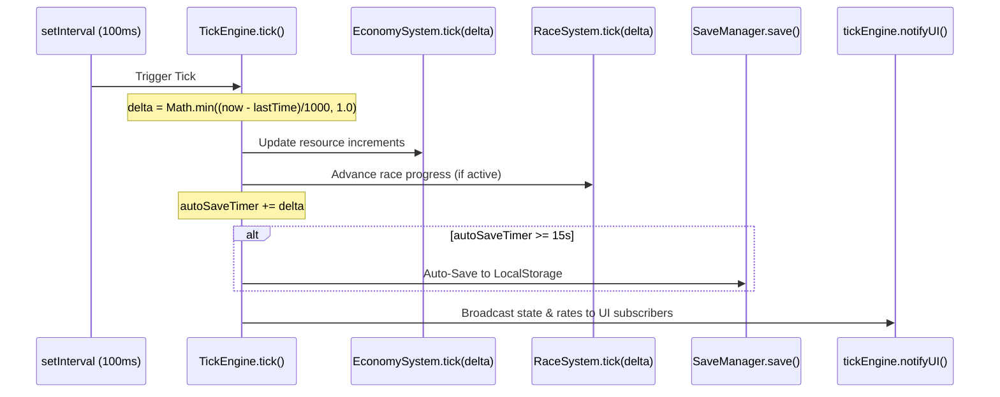

# Module 01: Core Architecture & Game Engine

This module documents the foundation of **MotoGP Manager**: the centralized reactive state container, the fixed-frequency tick loop, offline progress processing, environment configuration, save serialization, and the application lifecycle bootstrap sequence.

---

## 📁 File Structure

```
src/
├── config/
│   └── env.js            # Environment detection, debug flags, app metadata
├── engine/
│   ├── GameState.js      # Canonical state schema & GameStateStore pub/sub class
│   ├── TickEngine.js     # 10Hz game loop, delta-capping, offline math, auto-save
│   └── SaveManager.js    # LocalStorage persistence, migration merge, base64 export
└── main.js               # Application bootstrap, DOM listener registration
```

---

## ⚙️ 1. Environment Configuration (`src/config/env.js`)

Centralizes environment inspection and configuration parameters across client and server/test runtimes.

### Key Functions
- `getEnv()`: Detects active environment by inspecting `import.meta.env` (Vite) and `process.env` (Node/test runners). Returns `'dev'` or `'production'`.
- `isDev()`: Helper returning boolean `true` if current mode is `'dev'` or `'development'`.
- `getConfig()`: Returns an immutable configuration payload:
  - `env`: Detected environment string.
  - `isDev`: Boolean indicator.
  - `title`: Application title string (`VITE_APP_TITLE` or fallback).
  - `version`: Version string (`VITE_APP_VERSION` or `'1.1.0'`).
  - `autoSaveIntervalSec`: Auto-save frequency in seconds (default `15`).
  - `debugMode`: Boolean enabling developer capabilities (e.g., calendar rewind).

---

## 🗃️ 2. Centralized State Store (`src/engine/GameState.js`)

All runtime game state is held in a single mutable store governed by the `GameStateStore` singleton, exported as `gameState`.

### Canonical `INITIAL_STATE` Schema

```javascript
export const INITIAL_STATE = {
    version: "1.1.0",
    lastSaved: Date.now(),

    // Tier & Season Progression
    tier: 1, // 1: Moto3, 2: Moto2, 3: MotoGP Premier Class
    tierName: "Tier 1: Moto3 Local Garage",
    season: 1,

    // Resources
    cash: 500,
    telemetry: 0,
    telemetryMax: 100,
    science: 0,
    scienceMax: 50,
    parts: 0,
    partsMax: 50,
    hype: 10,
    heritageTokens: 0,

    // Manual Action Amounts (Pit Lane Clicks)
    clickTelemetryAmount: 1,
    clickPartsAmount: 1,
    clickSponsorAmount: 10,

    // Producers Owned { id: count }
    producers: {
        dyno_bench: 0, manual_lathe: 0, data_analyst: 0,
        local_fan_club: 0, wind_tunnel_slot: 0, cnc_milling_vMC: 0,
        telemetry_rig: 0, ai_telemetry_hub: 0, hospitality_suite: 0
    },

    // Unlocked R&D Tech Node IDs
    unlockedTech: [],

    // Active Bike Hardware
    bike: {
        modelName: "Moto3 Entry Prototype",
        powerHP: 55,
        aeroDownforce: 10,
        chassisGrip: 15,
        ecuIntelligence: 5,
        reliability: 95
    },

    // Lead Rider Attributes
    rider: {
        name: "Marco Rossi",
        overallSkill: 60,
        cornering: 58, braking: 60, consistency: 62, wetSkill: 55,
        corneringLvl: 1, brakingLvl: 1, consistencyLvl: 1, wetLvl: 1,
        injury: null
    },

    // Pit Crew & Engineers Hired { id: level }
    crew: {
        chief_mechanic: 0, data_engineer: 0, aerodynamicist: 0,
        telemetry_chief: 0, physio_trainer: 0
    },

    // Interactive Race Weekend State
    raceState: {
        currentGPIndex: 0,
        stage: "FP1",             // "FP1", "PR", "Q1", "Q2", "SPRINT", "RACE"
        sessionType: "RACE",      // "SPRINT" or "RACE"
        strategy: "balanced",     // "balanced", "push", "conserve"
        fpCompleted: false,
        practiceCompleted: false,
        directQ2: false,
        q1Completed: false,
        q2Completed: false,
        sprintCompleted: false,
        qpGridPosition: 12,
        grid: [],
        raceInProgress: false,
        currentLap: 0,
        totalLaps: 12,
        trackProgress: 0,         // 0% to 100%
        lapTimes: [],
        leaderboard: [],
        lapHistory: [],
        fastestLap: null,
        sessionFastestSectors: [null, null, null, null],
        raceLogs: [],
        seasonPoints: 0,
        weather: "dry",           // "dry" or "wet"
        trackTempC: 28,
        tireCompound: "medium",   // "soft", "medium", "hard", "wet"
        tireType: "slicks",
        tireCondition: 100,       // 100% down to 0%
        flagState: {
            status: "GREEN",      // "GREEN", "YELLOW", "RED", "WHITE_CROSS"
            sector: null,
            lapsRemaining: 0,
            reason: "Track clear"
        },
        redFlagged: false,
        totalDnfsInRace: 0,
        activeIncident: null
    },

    // Permanent Prestige Progress
    heritagePerks: [],
    totalPrestigeResets: 0,

    // Real-time Event Log (Max 50 items)
    logs: [
        "Paddock Garage initialized. Start testing bike telemetry and tuning stock parts!"
    ]
};
```

### `GameStateStore` Methods
- `getState()`: Returns the direct reference to the current runtime state object.
- `setState(newState)`: Shallow-merges `newState` into `this.state` and invokes `notify()`.
- `update(updaterFn)`: Executes an in-place mutation function `updaterFn(this.state)` followed by `notify()`.
- `subscribe(listener)`: Subscribes a listener callback `(state) => void`. Returns an unsubscribe teardown function.
- `notify()`: Triggers all subscribed listener callbacks with the active state.
- `addLog(msg, type)`: Prepends a timestamped log message `[HH:MM:SS] <msg>` to `state.logs` and trims the array to 50 items.
- `resetState()`: Deep-clones `INITIAL_STATE` and resets the store.

---

## ⏱️ 3. Game Loop & Offline Calculations (`src/engine/TickEngine.js`)

The `TickEngine` drives time-dependent calculations at a fixed frequency of **10 Hz** (100ms interval).

### Loop Flow & Delta Safety


### Key Technical Details
1. **Delta-Time Capping**: To prevent physics explosion or economy spikes when the browser tab is backgrounded or throttled, `delta` is clamped to a maximum of `1.0` second:
   ```javascript
   const delta = Math.min((now - this.lastTime) / 1000, 1.0);
   ```
2. **Auto-Save Timer**: An internal accumulator tracks elapsed delta time; when it reaches `15.0` seconds, `SaveManager.save()` is executed.
3. **Offline Progress Calculation**:
   Upon engine startup, if an existing save exists:
   - Calculate elapsed seconds: `offlineSecs = (now - state.lastSaved) / 1000`.
   - Threshold check: Must be greater than 5 seconds.
   - Cap limit: Capped at **12 hours** (`12 * 3600 = 43,200 seconds`).
   - `EconomySystem.calculateOfflineGains(cappedSecs)` increments resources subject to storage capacity limits (`telemetryMax`, `scienceMax`, `partsMax`).
   - A welcome message with formatted gains is logged.

---

## 💾 4. Persistence & Save Management (`src/engine/SaveManager.js`)

Persists state to the browser's `localStorage` under the key `motogp_manager_save_v1`.

### Core Operations

### A. Saving (`SaveManager.save()`)
- Updates `state.lastSaved = Date.now()`.
- Serializes `state` to JSON.
- Writes to `localStorage.setItem('motogp_manager_save_v1', serialized)`.
- Handles exceptions gracefully (e.g., storage quota exceeded).

### B. Loading & Backward-Compatible Migration (`SaveManager.load()`)
When loading existing saves from disk, older versions may lack newly added fields or subsystems (such as new crew types, calendar properties, or bike attributes). `SaveManager` prevents `undefined` crashes via **deep schema merging**:
```javascript
const merged = {
    ...INITIAL_STATE,
    ...parsed,
    producers: { ...INITIAL_STATE.producers, ...(parsed.producers || {}) },
    bike: { ...INITIAL_STATE.bike, ...(parsed.bike || {}) },
    rider: { ...INITIAL_STATE.rider, ...(parsed.rider || {}) },
    crew: { ...INITIAL_STATE.crew, ...(parsed.crew || {}) },
    raceState: { ...INITIAL_STATE.raceState, ...(parsed.raceState || {}) }
};
gameState.setState(merged);
```

### C. Save Export & Import
- `exportSaveString()`: Serializes current state to JSON, runs `encodeURIComponent()`, and converts to a portable **Base64** string via `btoa()`.
- `importSaveString(saveString)`: Decodes via `atob()` and `decodeURIComponent()`, validates structure (ensures `parsed.version` exists), merges with `INITIAL_STATE`, persists, and updates game state.
- `hardReset()`: Removes `motogp_manager_save_v1` from `localStorage` and resets `gameState` to factory defaults.

---

## 🚀 5. Application Bootstrap Sequence (`src/main.js`)

When the browser fires `DOMContentLoaded`, `main.js` orchestrates startup in a strict sequence:

1. **Initialize UI Event Listeners**:
   - `TabsManager.init()`
   - `UIComponents.initEvents()`
   - `RaceView.initEvents()`
   - `CalendarView.initEvents()`
   - `PreSeasonTestView.initEvents()`
   - `LongRunSimView.initEvents()`
2. **Bind Settings Modal & Persistence Controls**:
   - Manual Save button (`btn-manual-save`)
   - Export Save to clipboard (`btn-export-save`)
   - Import Save modal submit (`btn-import-save`)
   - Hard Reset with safety confirmation prompt (`btn-hard-reset`)
3. **Register UI Subscribers to `tickEngine`**:
   ```javascript
   tickEngine.subscribe((state, rates) => {
       UIComponents.render(state, rates);
       RaceView.render(state);
       CalendarView.render(state);
   });
   ```
4. **Start Game Loop**:
   - Calls `tickEngine.start()`, which loads existing saves, calculates offline gains, and begins `setInterval` at 100ms.
