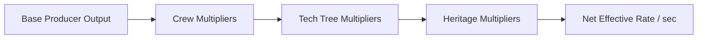

# Module 02: Economy, Producers & Bike Hardware

This module details the financial engine, passive resource producers, manual pit-lane work, cost-scaling mathematical formulas, multiplier stacking rules, and bike hardware rating physics.

---

## 📁 File Structure

```
src/
└── systems/
    ├── EconomySystem.js   # Production units, rates, cost curve, offline income
    └── BikeSystem.js      # Machine ratings, staff stat modifiers, top speed physics
```

---

## 💎 1. Resource Economy Overview

The paddock economy operates around five core primary currencies and tokens:

| Currency | Icon | Source | Cap Mechanics | Purpose |
| :--- | :---: | :--- | :--- | :--- |
| **Budget Cash ($)** | 💵 | Fan club, hospitality suites, manual clicks, race prize money, sponsor deals. | No upper cap | Buying producers, hiring crew, rider skill training, category promotions. |
| **Telemetry Data** | 📡 | Dyno benches, wind tunnels, track laps, manual logging. | Capped by `telemetryMax` (Base: 100) | Required to run R&D tech and electronics mapping. |
| **Research Points (RP)** | 🧪 | Data analysts, cloud AI hubs, wind tunnels, test stint laps. | Capped by `scienceMax` (Base: 50) | Unlocking nodes in the R&D Tech Tree. |
| **Spare Parts** | ⚙️ | Pit lathes, 5-axis CNC centers, manual fabrication. | Capped by `partsMax` (Base: 50) | Manufacturing hardware upgrades and aerodynamic packages. |
| **Fan Hype / Rep** | 🔥 | Race podiums, calendar media sessions, season launches. | Scaled linearly | Requirement gate for tier promotions and prestige rewards. |

---

## 🏭 2. Paddock Production Units (`PRODUCERS`)

Passive resource income is driven by acquiring paddock production assets. Each unit has a base purchase cost, an exponential cost scaling coefficient, and a base yield per second.

### Full Producer Specification Table

| Producer ID | Name | Icon | Base Cost | Multiplier | Base Output / sec | Min Tier | Description |
| :--- | :--- | :---: | :--- | :---: | :--- | :---: | :--- |
| `dyno_bench` | Manual Dyno Bench | 📊 | $50 | 1.15 | +0.5 Telemetry | 1 | Automated engine dyno tests for telemetry logs. |
| `manual_lathe` | Pit Lathe & Machine | 🛠️ | $100 | 1.15 | +0.3 Parts | 1 | Machines spare titanium bolts, spacers, and brackets. |
| `local_fan_club` | Local Fan Booth & Merch | 🧢 | $150 | 1.15 | +$3.0 Cash | 1 | Sells caps, shirts, and paddock tickets. |
| `data_analyst` | Junior Data Analyst | 💻 | $350 | 1.18 | +0.3 RP | 1 | Translates raw Telemetry into actionable Research. |
| `wind_tunnel_slot` | Wind Tunnel Testing Slot | 🌀 | $1,200 + 20 Parts | 1.20 | +2.0 Telemetry, +0.8 RP | 2 | Simulates aerodynamic airflow at scale. |
| `cnc_milling_vMC` | 5-Axis CNC Milling Center | ⚙️ | $2,500 + 40 Parts | 1.22 | +1.5 Parts | 2 | High-precision machining of carbon parts and blocks. |
| `hospitality_suite` | VIP Paddock Hospitality | 🥂 | $8,000 | 1.25 | +$45.0 Cash | 3 | Hosts corporate sponsors and VIP guests. |
| `ai_telemetry_hub` | Cloud Telemetry Supercomputer | 🖥️ | $25,000 + 100 RP | 1.28 | +8.0 Telemetry, +4.5 RP | 3 | Deep learning ECU telemetry analysis cluster. |

---

## 📐 3. Mathematical Models & Formulas

### A. Cost Scaling Formula
The purchase cost of the $N$-th unit of a producer is calculated using geometric progression:

$$\text{Cost}(N) = \left\lfloor \text{BaseCost} \times (\text{CostMultiplier})^N \right\rfloor$$

Where:
- $N$ is the number of units currently owned (`state.producers[prodId] || 0`).
- If a producer has multi-resource costs (e.g. Cash + Parts), the multiplier is applied independently to each component cost.

```javascript
static getProducerCost(prodId) {
    const prod = PRODUCERS.find(p => p.id === prodId);
    const count = state.producers[prodId] || 0;
    const mult = Math.pow(prod.costMultiplier, count);

    const cost = {};
    if (prod.baseCost.cash) cost.cash = Math.floor(prod.baseCost.cash * mult);
    if (prod.baseCost.telemetry) cost.telemetry = Math.floor(prod.baseCost.telemetry * mult);
    if (prod.baseCost.science) cost.science = Math.floor(prod.baseCost.science * mult);
    if (prod.baseCost.parts) cost.parts = Math.floor(prod.baseCost.parts * mult);
    return cost;
}
```

### B. Multiplier Stacking Hierarchy
Resource rates are computed every tick in `EconomySystem.getRates()`. Multipliers from Staff, Research Tech, and Heritage Perks apply multiplicatively:



1. **Crew Multipliers**:
   - `partsRate *= (1 + state.crew.chief_mechanic * 0.15)` (+15% per level)
   - `scienceRate *= (1 + state.crew.data_engineer * 0.15)` (+15% per level)
   - `telemetryRate *= (1 + state.crew.telemetry_chief * 0.20)` (+20% per level)

2. **R&D Tech Multipliers**:
   - `adv_dyno`: `telemetryRate *= 1.5` (+50%)
   - `carbon_autoclave`: `partsRate *= 1.5` (+50%)
   - `sponsor_manager`: `cashRate *= 1.5` (+50%)
   - `telemetry_cloud`: `scienceRate *= 1.5` (+50%)

3. **Heritage Rebirth Perks**:
   - `heritage_paddock_brand`: `cashRate *= 2.0` (2x permanently)
   - `heritage_fast_rnd`: `scienceRate *= 2.0` (2x permanently)

---

## 🖱️ 4. Manual Pit Lane Work (`manualClick`)

Players can manually generate resources by performing pit actions:
- **Telemetry Shakedown**: Adds `state.clickTelemetryAmount` (default 1) capped at `telemetryMax`.
- **Machining Spare Parts**: Adds `state.clickPartsAmount` (default 1) capped at `partsMax`.
- **Pitching Sponsors**: Adds `state.clickSponsorAmount` (default $10).

---

## 🏍️ 5. Bike Hardware & Performance Engine (`src/systems/BikeSystem.js`)

The `BikeSystem` calculates composite ratings, top speed capabilities, and staff hardware bonuses.

### Core Machine Attributes
- **Engine Power (`powerHP`)**: Dictates straightaway speed and acceleration off turns.
- **Aero Downforce (`aeroDownforce`)**: Keeps the front tire grounded at 300+ km/h and stabilizes heavy braking.
- **Chassis Grip (`chassisGrip`)**: Governs mid-corner lean angle, trail-braking stability, and tire preservation.
- **ECU Intelligence (`ecuIntelligence`)**: Anti-wheelie, traction control, engine braking, and throttle response mapping.
- **Reliability (`reliability`)**: Percentage rating against mechanical failure and DNF.

### Performance Math Formulas

#### 1. Machine Overall Rating
A weighted composite calculation emphasizing horsepower and handling balance:

$$\text{OverallRating} = \text{round}\left( (\text{HP} \times 0.40) + (\text{Aero} \times 0.25) + (\text{Chassis} \times 0.25) + (\text{ECU} \times 0.10) \right)$$

#### 2. Top Speed Physics Approximation
Top speed down circuit straightaways (in km/h) scales with effective engine horsepower:

$$\text{TopSpeed}_{\text{km/h}} = \text{round}\left( 180 + (\text{HP} \times 0.95) \right)$$

*Example*:
- Moto3 Prototype (55 HP): $180 + (55 \times 0.95) = 232\text{ km/h}$.
- Moto2 Kalex (140 HP): $180 + (140 \times 0.95) = 313\text{ km/h}$.
- MotoGP Factory V4 (280 HP): $180 + (280 \times 0.95) = 446\text{ km/h}$ theoretical unconstrained terminal speed (governed by circuit drag).

#### 3. Staff Hardware Enhancements
If the team employs a Lead Aerodynamicist (`crew.aerodynamicist > 0`), the effective downforce receives an immediate hardware bonus:
```javascript
if (crew.aerodynamicist > 0) {
    aero += crew.aerodynamicist * 5; // +5 Downforce pts per level
}
```
