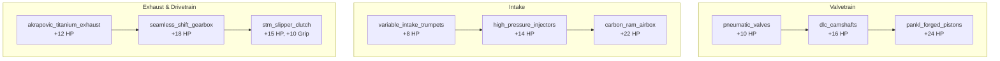
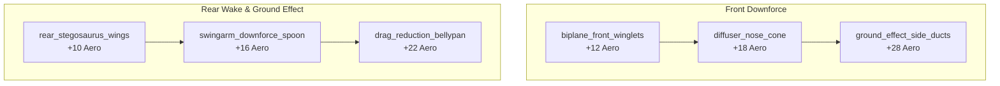
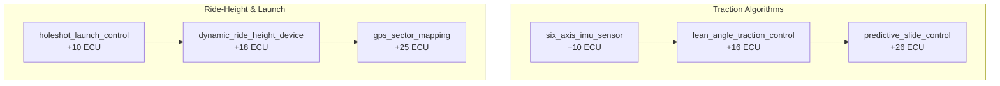

# Module 03: R&D Engineering & Tech Tree

This module provides exhaustive documentation on the **Research & Development (R&D) Tech Tree**, including tech node prerequisites, multi-resource costs, branch categorization, unlock conditions, and physical stat effects.

---

## 📁 File Structure

```
src/
└── systems/
    └── ResearchSystem.js   # Tech nodes database, prerequisite validation, purchase logic
```

---

## 🔬 1. Tech Tree Architecture

The Tech Tree is divided into four major racing domains:
1. **Engine & Powertrain (⚙️)**: Increases `bike.powerHP` and straightaway velocity.
2. **Aerodynamics (🦅)**: Increases `bike.aeroDownforce` and high-speed stability.
3. **Electronics & ECU (⚡)**: Increases `bike.ecuIntelligence` and launch/traction control.
4. **Storage & Infrastructure (🏭)**: Expands resource storage caps and boosts generation efficiency.

### System Verification Rules
- **Prerequisite Validation**: A node can only be researched if all nodes listed in its `prereq: [...]` array are already in `state.unlockedTech`.
- **Tier Gating**: Nodes specify `unlockedAtTier`. A player in Tier 1 (Moto3) cannot access Tier 2 (Moto2) or Tier 3 (MotoGP) technology regardless of resource reserves.
- **Affordability Check**: Inspects multi-currency requirements across Science (RP), Spare Parts, Telemetry, and Budget Cash.

---

## ⚙️ 2. Engine & Powertrain Branch



### Full Powertrain Node Catalog

| Tech ID | Name | Branch | Tier | Cost | Prereq | Stat Bonus | Effect Code |
| :--- | :--- | :--- | :---: | :--- | :--- | :--- | :--- |
| `pneumatic_valves` | Pneumatic Valve Return System | Valvetrain | 1 | 25 RP, 20 Parts | None | +10 HP | `s.bike.powerHP += 10` |
| `dlc_camshafts` | DLC-Coated High-Lift Camshafts | Valvetrain | 1 | 65 RP, 45 Parts | `pneumatic_valves` | +16 HP | `s.bike.powerHP += 16` |
| `pankl_forged_pistons` | Pankl Billet Slipper Pistons | Valvetrain | 2 | 140 RP, 90 Parts, $2,000 | `dlc_camshafts` | +24 HP | `s.bike.powerHP += 24` |
| `variable_intake_trumpets` | Variable-Length Intake Stacks | Intake | 1 | 20 RP, 15 Parts | None | +8 HP | `s.bike.powerHP += 8` |
| `high_pressure_injectors` | Twin-Spray 12-Hole Injectors | Intake | 1 | 55 RP, 40 Parts | `variable_intake_trumpets` | +14 HP | `s.bike.powerHP += 14` |
| `carbon_ram_airbox` | Carbon Fiber Ram-Air Duct | Intake | 2 | 120 RP, 80 Parts, 100 Tel | `high_pressure_injectors` | +22 HP | `s.bike.powerHP += 22` |
| `akrapovic_titanium_exhaust` | Akrapovič Titanium Exhaust | Exhaust | 1 | 30 RP, 25 Parts | None | +12 HP | `s.bike.powerHP += 12` |
| `seamless_shift_gearbox` | Seamless Zero-Cut Transmission | Drivetrain | 2 | 85 RP, 60 Parts | `akrapovic_titanium_exhaust` | +18 HP, +5 km/h | `s.bike.powerHP += 18` |
| `stm_slipper_clutch` | STM Billet Dry Slipper Clutch | Drivetrain | 2 | 130 RP, 85 Parts | `seamless_shift_gearbox` | +15 HP, +10 Grip | `s.bike.powerHP += 15`<br/>`s.bike.chassisGrip += 10` |

---

## 🦅 3. Aerodynamics Branch



### Full Aerodynamics Node Catalog

| Tech ID | Name | Branch | Tier | Cost | Prereq | Stat Bonus | Effect Code |
| :--- | :--- | :--- | :---: | :--- | :--- | :--- | :--- |
| `biplane_front_winglets` | Carbon Biplane Front Winglets | Front Aero | 1 | 25 RP, 20 Parts | None | +12 Aero | `s.bike.aeroDownforce += 12` |
| `diffuser_nose_cone` | Front Aero Diffuser & Shrouds | Front Aero | 1 | 65 RP, 45 Parts | `biplane_front_winglets` | +18 Aero | `s.bike.aeroDownforce += 18` |
| `ground_effect_side_ducts` | Ground-Effect Step-Down Ducts | Front Aero | 2 | 140 RP, 90 Parts, $2,200 | `diffuser_nose_cone` | +28 Aero | `s.bike.aeroDownforce += 28` |
| `rear_stegosaurus_wings` | Stegosaurus Rear Tail Fin Spoilers | Rear Aero | 1 | 20 RP, 15 Parts | None | +10 Aero | `s.bike.aeroDownforce += 10` |
| `swingarm_downforce_spoon` | Under-Swingarm Rear Spoon | Rear Aero | 1 | 60 RP, 40 Parts | `rear_stegosaurus_wings` | +16 Aero | `s.bike.aeroDownforce += 16` |
| `drag_reduction_bellypan` | Low-Drag Laminar Bellypan | Rear Aero | 2 | 125 RP, 80 Parts | `swingarm_downforce_spoon` | +22 Aero, +6 km/h | `s.bike.aeroDownforce += 22` |

---

## ⚡ 4. Electronics & ECU Branch



### Full Electronics Node Catalog

| Tech ID | Name | Branch | Tier | Cost | Prereq | Stat Bonus | Effect Code |
| :--- | :--- | :--- | :---: | :--- | :--- | :--- | :--- |
| `six_axis_imu_sensor` | Magneti Marelli 6-Axis IMU | Traction | 1 | 25 RP, 30 Tel | None | +10 ECU | `s.bike.ecuIntelligence += 10` |
| `lean_angle_traction_control` | Lean-Angle Traction Control | Traction | 1 | 70 RP, 75 Tel | `six_axis_imu_sensor` | +16 ECU | `s.bike.ecuIntelligence += 16` |
| `predictive_slide_control` | Predictive Slide Control Engine | Traction | 2 | 145 RP, 140 Tel, $2,000 | `lean_angle_traction_control` | +26 ECU | `s.bike.ecuIntelligence += 26` |
| `holeshot_launch_control` | Mechanical Holeshot Device | Ride-Height | 1 | 30 RP, 20 Parts | None | +10 ECU, +15% Launch | `s.bike.ecuIntelligence += 10` |
| `dynamic_ride_height_device` | Dynamic Hydraulic Ride-Height | Ride-Height | 1 | 75 RP, 80 Tel | `holeshot_launch_control` | +18 ECU | `s.bike.ecuIntelligence += 18` |
| `gps_sector_mapping` | GPS Corner-by-Corner Mapping | Ride-Height | 2 | 150 RP, 150 Tel | `dynamic_ride_height_device` | +25 ECU | `s.bike.ecuIntelligence += 25` |

---

## 🏭 5. Storage & Factory Infrastructure Branch

Infrastructure nodes upgrade the physical factory, allowing higher resource accumulation caps and permanently boosting passive economy rates:

| Tech ID | Name | Tier | Cost | Prereq | In-Game Effect | Implementation |
| :--- | :--- | :---: | :--- | :--- | :--- | :--- |
| `science_storage_1` | R&D Data Server Vault | 1 | 15 RP, $120 | None | +50 Max RP Storage | `s.scienceMax += 50` |
| `science_storage_2` | High-Performance Compute Cluster | 1 | 40 RP, $450 | `science_storage_1` | +100 Max RP Storage | `s.scienceMax += 100` |
| `science_storage_3` | Quantum Simulation Server | 2 | 120 RP, $2,500 | `science_storage_2` | +250 Max RP Storage | `s.scienceMax += 250` |
| `telemetry_storage_1` | High-Density Telemetry Racks | 1 | 10 RP, $100 | None | +100 Max Telemetry Storage | `s.telemetryMax += 100` |
| `parts_bin_1` | Modular Part Shelving & Autoclave | 1 | 15 RP, $150 | None | +50 Max Parts Storage | `s.partsMax += 50` |
| `adv_dyno` | Automated Dyno Engine Test Bench | 1 | 45 RP, $400 | None | +50% Telemetry Production | Multiplier in `EconomySystem` |
| `carbon_autoclave` | High-Pressure Carbon Autoclave | 1 | 50 RP, 30 Parts | None | +50% Spare Parts Production | Multiplier in `EconomySystem` |
| `sponsor_manager` | Paddock PR & Hospitality Manager | 1 | 60 RP, $800 | None | +50% Commercial Cash Revenue | Multiplier in `EconomySystem` |
| `telemetry_cloud` | Cloud Telemetry Analytics Server | 2 | 90 RP, $1,500, 80 Tel | `adv_dyno` | +50% Research Points (RP) Rate | Multiplier in `EconomySystem` |
