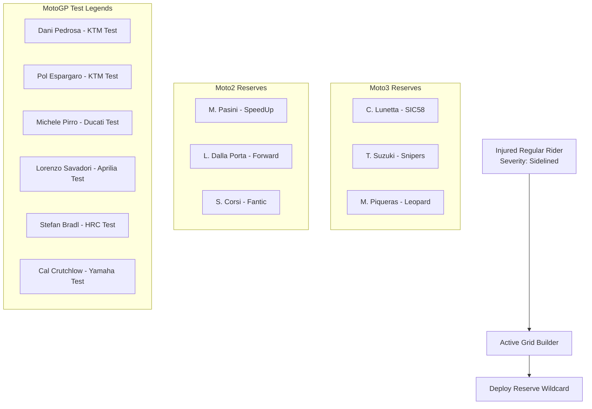

# Module 04: Riders, Paddock Staff & Healthcare Engine

This module documents the **Rider Database**, dynamic performance algorithm, paddock healthcare and injury engine, reserve replacement system, rider training, and pit crew engineering staff.

---

## 📁 File Structure

```
src/
└── systems/
    ├── RiderSystem.js   # 70+ Rider database, performance math, injury & form engine
    └── StaffSystem.js   # Rider training upgrades & pit crew engineer hiring
```

---

## 🏍️ 1. Authentic Paddock Rider Databases

The game models authentic 2026 grids across all three FIM Grand Prix world championship classes, with realistic attributes:
- **Speed**: Raw qualifying and single-lap time-attack pace.
- **Racecraft**: Wheel-to-wheel race combat, overtakes, and defensive positioning.
- **Consistency**: Lap-to-lap variance reduction and error avoidance.
- **Wet Skill**: Performance scaling under rainfall and changing track grip.
- **Tire Management**: Carcass preservation over race distance.
- **Aggression**: Overtake frequency and crash risk exposure.
- **Bike Rating**: Mechanical baseline of the rider's machinery.
- **Favorite Tracks**: Circuits where the rider gains an authentic home/specialist pace bonus.

### Roster Breakdown by Category

#### A. Moto3™ World Championship (Tier 1) - 26 Official Riders
- **CFMOTO Aspar Team**: M. Quiles (86 Speed), M. Morelli (79 Speed)
- **CIP Green Power**: A. Cruces (83 Speed), S. Ogden (76 Speed, 88 Wet)
- **CODE Motorsports**: C. Buchanan (78 Speed), R. Moodley (74 Speed)
- **AEON Credit MT Helmets - MSi**: R. Yamanaka (84 Speed), H. Danish (77 Speed)
- **Honda Team Asia**: V. Pratama (82 Speed), Z. Mitani (75 Speed)
- **Leopard Racing**: A. Fernandez (85 Speed)
- **LEVELUP - MTA**: J. Esteban (79 Speed), M. Bertelle (81 Speed)
- **LIQUI MOLY Dynavolt Intact GP**: D. Muñoz (87 Speed, 92 Aggression), D. Almansa (78 Speed)
- **Red Bull KTM Ajo**: A. Carpe (82 Speed), B. Uriarte (80 Speed)
- **Red Bull KTM Tech3**: V. Perrone (77 Speed), R. Salmela (79 Speed)
- **SIC58 Squadra Corse**: C. O'Gorman (76 Speed), L. Rammerstorfer (73 Speed)
- **Rivacold Snipers Team**: J. Rios (75 Speed), N. Carraro (78 Speed)
- **FleetSafe Honda - MLav Racing**: J. Kelso (81 Speed), E. O'Shea (74 Speed)

#### B. Moto2™ World Championship (Tier 2) - 22 Official Riders
- **MT Helmets - MSI**: S. Garcia (89 Speed), A. Ogura (91 Speed, 90 Racecraft)
- **Sync SpeedUp Boscoscuro**: F. Aldeguer (92 Speed), A. Lopez (87 Speed, 90 Aggression)
- **OnlyFans American Racing**: J. Roberts (88 Speed), M. Ramirez (82 Speed)
- **Red Bull KTM Ajo**: C. Vietti (88 Speed), D. Alonso (93 Speed, 91 Racecraft)
- **QJMOTOR Gresini Moto2**: M. Gonzalez (87 Speed)
- **KLINT Forward Factory**: A. Escrig (78 Speed)
- **Elf Marc VDS Racing**: T. Arbolino (89 Speed, 92 Wet), F. Salac (81 Speed)
- **Fantic Racing Kalex**: A. Canet (91 Speed), X. Cardelus (75 Speed)
- **RW-Idrofoglia Racing**: B. Baltus (83 Speed), Z. van den Goorbergh (82 Speed)
- **Liqui Moly Husqvarna Intact**: D. Binder (84 Speed), S. Agius (83 Speed)
- **CFMoto Aspar Team**: I. Guevara (86 Speed), D. Holgado (88 Speed)
- **Preicanos Racing Team**: J. Masia (84 Speed), D. Munoz (80 Speed)

#### C. Premier Class MotoGP™ (Tier 3) - 22 Factory & Satellite Riders
- **Ducati Lenovo Team**: F. Bagnaia (98 Speed, 98 Bike), M. Marquez (99 Speed, 99 Racecraft, 97 Wet)
- **Aprilia Racing Factory**: J. Martin (98 Speed, 94 Aggression), M. Bezzecchi (93 Speed, 94 Wet)
- **Red Bull KTM Factory Racing**: P. Acosta (96 Speed, 95 Racecraft), B. Binder (92 Speed, 96 Aggression)
- **Red Bull KTM Tech3**: E. Bastianini (95 Speed, 97 Tire Mgmt), M. Vinales (94 Speed)
- **Monster Energy Yamaha**: F. Quartararo (95 Speed, 93 Consistency), A. Rins (89 Speed)
- **Pertamina Enduro VR46**: F. Di Giannantonio (92 Speed), F. Morbidelli (90 Speed)
- **Gresini Racing MotoGP**: A. Marquez (92 Speed), F. Aldeguer (91 Speed)
- **CASTROL / IDEMITSU Honda LCR**: J. Zarco (90 Speed, 96 Wet), S. Chantra (82 Speed)
- **Repsol Honda Team**: J. Mir (90 Speed), L. Marini (86 Speed, 91 Consistency)
- **Prima Pramac Yamaha**: J. Miller (91 Speed, 98 Wet), M. Oliveira (89 Speed, 96 Wet)
- **Trackhouse Racing Aprilia**: R. Fernandez (89 Speed), A. Ogura (88 Speed)

---

## 📈 2. Dynamic Performance Score Algorithm

In every practice, qualifying, and race session, a rider's lap performance score is calculated dynamically using the formula in `RiderSystem.calculateRiderPerformanceScore()`:

$$\begin{aligned}
\text{BaseScore} &= (\text{BikeRating} \times 0.40) + (\text{Speed} \times 0.45) + (\text{Racecraft} \times 0.10) + (\text{Consistency} \times 0.05) \\
\text{TotalScore} &= \text{BaseScore} + \Delta_{\text{Track}} + \Delta_{\text{Wet}} \times \text{Form} - \text{Penalty}_{\text{Injury}} + \text{Variance}_{\text{Session}}
\end{aligned}$$

### Multiplier & Modifier Definitions
1. **Favorite Track Specialist Bonus**:
   - If circuit ID is in `rider.favoriteTracks`, awards $+4.2$ points ($\sim 0.35\text{s} - 0.50\text{s}$ per lap advantage).
2. **Wet Weather Mastery**:
   - When track condition is `'wet'`:
     $$\Delta_{\text{Wet}} = (\text{wetSkill} - 75) \times 0.25$$
   - Rain specialists (e.g., Jack Miller with 98 Wet Skill) gain huge performance advantages in stormy conditions.
3. **Dynamic Form & Confidence**:
   - Paddock riders fluctuate between $0.92$ and $1.08$ form based on recent race results and crash incidents.
4. **Natural Session Variance**:
   - A random flutter between $-1.4$ and $+1.4$ points simulates tire scrub, traffic, and track temperature spikes.
5. **Score Bounds**:
   - Clamped between a minimum of $50.0$ and a maximum of $99.8$.

---

## 🩺 3. Paddock Healthcare & Injury Engine

Crashes during practice sessions or Grand Prix races can inflict physical trauma on riders.

### Crash Probability & Evaluation
- When a rider crashes, `RiderSystem.processRiderCrash()` is invoked.
- There is a **35% probability** of sustaining an injury.
- If injured, an injury template is drawn from `INJURY_TYPES`.

### Official Medical Injury Protocols (`INJURY_TYPES`)

| Type | Injury Name | Severity | Pace Penalty | Sidelined | Recovery | Medical Description |
| :--- | :--- | :---: | :---: | :---: | :---: | :--- |
| `arm_pump` | Arm Pump Strain | Minor | -8% Pace | No (0 Races) | 2 Races | Forearm muscular compartment syndrome. |
| `wrist_sprain` | Sprained Throttle Wrist | Minor | -12% Pace | No (0 Races) | 1 Race | Hyperextension from gravel trap impact. |
| `bruised_ribs` | Bruised Ribs | Minor | -6% Pace | No (0 Races) | 1 Race | High-G landing impact against curb. |
| `concussion` | Concussion Protocol | Sidelined | -100% (Out) | Yes (1 GP) | 1 Race | Mandatory FIM neurological stand-down. |
| `collarbone` | Fractured Collarbone | Sidelined | -100% (Out) | Yes (2 GPs) | 2 Races | Titanium plate fixation surgery required. |
| `scaphoid` | Fractured Scaphoid | Sidelined | -100% (Out) | Yes (2 GPs) | 2 Races | Wrist fracture from highside fall. |

### Reserve Replacement System
When an AI or competitor rider is sidelined with a severe injury (`severity === 'sidelined'`):
- The `RiderSystem.getActiveGridRoster()` method automatically substitutes them with an official factory test or reserve rider:



The reserve rider competes with the team's livery and bike rating, while display badges clearly label them: `D. Pedrosa (Sub) [Replacing F. Bagnaia - Fractured Collarbone]`.

---

## 👨‍🔧 4. Rider Training & Pit Crew Staff (`src/systems/StaffSystem.js`)

### A. Lead Rider Skill Training
Players can train their lead rider across four foundational disciplines:
1. **Cornering (`cornering`)**: Lean-angle carrying speed in mid-corner apexes.
2. **Braking (`braking`)**: Stopping power and late-braking dive capability.
3. **Consistency (`consistency`)**: Lap time reproducibility and lower error rates.
4. **Wet Weather (`wetSkill`)**: Handling in mixed or damp rain conditions.

#### Training Cost Formula
Training costs scale with the current skill level:

$$\text{TrainingCost}(\text{Level}) = \left\lfloor 100 \times (1.30)^{\text{Level} - 1} \right\rfloor$$

Each upgrade grants $+3$ points to the respective skill and recalculates `overallSkill`:
$$\text{overallSkill} = \text{round}\left( \frac{\text{cornering} + \text{braking} + \text{consistency} + \text{wetSkill}}{4} \right)$$

### B. Pit Crew & Engineering Staff (`CREW_TYPES`)

| Crew ID | Role | Icon | Base Cost | Scale | Operational Benefit |
| :--- | :--- | :---: | :--- | :---: | :--- |
| `chief_mechanic` | Chief Pit Mechanic | 👨‍🔧 | $200 | 1.50 | +15% Spare Parts production rate per level. |
| `data_engineer` | Senior Telemetry Engineer | 💻 | $350 | 1.50 | +15% Research Points (RP) generation rate per level. |
| `aerodynamicist` | Lead Aerodynamicist | 𛩩️ | $500 + 30 RP | 1.60 | +5 Aero Downforce added directly to bike hardware per level. |
| `telemetry_chief` | Chief Data Analyst | 📡 | $400 | 1.50 | +20% Telemetry generation rate per level. |
| `physio_trainer` | Paddock Physio Trainer | 🩺 | $300 | 1.50 | +5 Consistency boost, accelerates recovery, and instantly heals rider injury on hire. |
