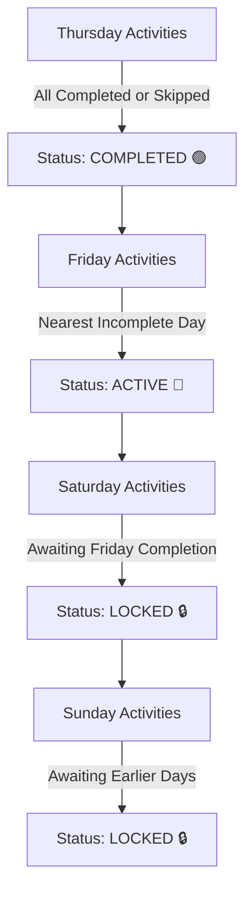

# Module 05: Season Calendar & Agenda System

This module covers the **22-Round Grand Prix Season Calendar**, week types, chronological day-by-day scheduling, sequential day locking, mandatory versus optional activities, week progression, and developer controls.

---

## 📁 File Structure

```
src/
└── systems/
    └── CalendarSystem.js   # 22-Round calendar template, day sequencing, activity resolution
```

---

## 📅 1. Calendar Structure & Week Types

The championship calendar is defined in `SEASON_WEEKS_TEMPLATE`, modeling an authentic season timeline from February testing through the November Valencia finale:

### Week Classification
1. **Official Pre-Season Test Weeks (`test_week`)**:
   - E.g., Week 1 (Official Sepang Pre-Season Test).
   - Hosts shakedowns, full-day timing tests with prototype selection (`preseason_test`), and 20-lap race distance simulations (`long_run_sim`).
2. **Factory Aerodynamics & Logistics Weeks (`factory_week`)**:
   - E.g., Week 2 (Factory Aerodynamics & Travel Prep).
   - Features global livery unveils, commercial media shoots, and factory engine bench break-ins.
3. **Grand Prix Race Weeks (`race_week`)**:
   - 22 official championship rounds spanning Southeast Asia, the Americas, Europe, and Australasia.
   - Enforces the official FIM weekend schedule: Press conferences, track walks, FP1 shakedowns, Timed Practice (PR), Qualifying (Q1/Q2), Saturday Sprint, and Sunday GP.
4. **Mid-Season Summer Break (`summer_break`)**:
   - Week 21 (MotoGP™ Summer Break & Factory Rebuild).
   - Mandatory factory shutdown with rider altitude training and physical therapy.
5. **In-Season Development Test Weeks (`test_week`)**:
   - Week 11 (Official Post-Jerez Monday Test).
   - Allows in-season aerodynamic back-to-back comparisons.

---

## 🗺️ 2. The 22 Championship Grand Prix Rounds

```mermaid
journey
    title 2026 MotoGP World Championship Journey
    section Flyaway Opener
      Thai GP (Chang): 5: Round 1
      Argentine GP (Termas): 4: Round 2
      Americas GP (COTA): 4: Round 3
      Qatar GP (Lusail Night): 5: Round 4
    section European Heart
      Spanish GP (Jerez): 5: Round 5
      French GP (Le Mans): 4: Round 6
      British GP (Silverstone): 5: Round 7
      Aragon GP (MotorLand): 4: Round 8
      Italian GP (Mugello): 5: Round 9
      Dutch TT (Assen): 5: Round 10
      German GP (Sachsenring): 4: Round 11
      Czech GP (Brno): 4: Round 12
    section Summer & Mid-Season
      Summer Break (Shutdown): 3: Week 21
      Austrian GP (Spielberg): 4: Round 13
      Hungarian GP (Balaton): 4: Round 14
      Catalan GP (Barcelona): 5: Round 15
      San Marino GP (Misano): 5: Round 16
    section Asian & Oceanian Flyaways
      Japanese GP (Motegi): 5: Round 17
      Indonesian GP (Mandalika): 4: Round 18
      Australian GP (Phillip Island): 5: Round 19
      Malaysian GP (Sepang): 5: Round 20
    section European Finale
      Portuguese GP (Portimao): 5: Round 21
      Valencia Finale (Cheste): 5: Round 22
```

---

## ⏳ 3. Chronological Day Order & Sequential Locking

Each week's activities are organized across the chronological day order:

$$\text{DAY\_ORDER} = [\text{'Monday'}, \text{'Tuesday'}, \text{'Wednesday'}, \text{'Thursday'}, \text{'Friday'}, \text{'Saturday'}, \text{'Sunday'}, \text{'Midweek'}]$$

### Day Status Pipeline
In `CalendarSystem.getWeekDaysGrouped()`, days are evaluated in linear order:



1. **`completed` (🟢)**: All activities scheduled for this day are either finished or skipped.
2. **`active` (📍)**: The earliest chronological day that still contains unfinished activities. Player can interact with activities on this day.
3. **`locked` (🔒)**: Future days. The player cannot attend or skip activities on locked days until prior days are completed.

---

## 🎯 4. Activity Types & Execution Mechanics

When a player selects **"Attend"** or **"Launch"** on an activity (`CalendarSystem.attendActivity()`):

| Action Type | Target Function | UI Response / Execution |
| :--- | :--- | :--- |
| `preseason_test` | `PreSeasonTestView.open()` | Launches the interactive Sepang timing & prototype development modal. |
| `long_run_sim` | `LongRunSimView.open()` | Opens the 20-lap race pace telemetry dashboard modal. |
| `media` | Direct Claim | Awards Budget Cash ($800–$1,500) and Fan Hype (+25–+40). |
| `briefing` | Direct Claim | Awards Telemetry (+40) and Science RP (+20). |
| `race_fp1` | `RaceSystem.runFP1()` | Executes Free Practice setup shakedown and awards base parts/telemetry. |
| `race_pr` | `RaceSystem.runTimedPractice()` | Mandatory timed practice session deciding top-10 direct Q2 qualification. |
| `race_quali` | `RaceSystem.runQ1() / runQ2()` | Mandatory qualifying shootout determining grid positions P1–P22. |
| `race_sprint` | `RaceSystem.startSprintRace()` | Half-distance championship points race *(MotoGP Premier Class Tier 3 only)*. |
| `race_gp` | `RaceSystem.startGrandPrixRace()` | Full-distance Grand Prix World Championship feature race. |

### Tier-Specific Rules (Sprint Handling)
In Moto3 (Tier 1) and Moto2 (Tier 2), Sprint races are not run. `CalendarSystem` automatically ignores `race_sprint` requirement checks for Tiers 1 and 2:
```javascript
if (act.actionType === 'race_sprint' && state.tier < 3) {
    continue; // Moto3 and Moto2 skip sprints seamlessly
}
```

---

## ⏩ 5. Week Advancement & Season Completion

### Validation (`canProceedToNextWeek()`)
Before advancing, the engine inspects all activities in the current week marked as `required: true`. If any required activity is incomplete, progression is blocked with an alert:
```
⚠️ Cannot advance week! Complete mandatory activity: "<Activity Title>".
```

### Transition Logic (`proceedToNextWeek()`)
When validated:
1. Any uncompleted **optional** activities are automatically marked `'skipped'`.
2. Week index increments: `cal.currentWeekIndex += 1`.
3. If week index exceeds the calendar length:
   - Season counter increments: `state.season += 1`.
   - `cal.completedActivities` dictionary resets.
   - Paddock congratulatory message is logged.
4. **Paddock Health Progression**: Invokes `RiderSystem.advancePaddockAfterRace()`, healing rider injuries and normalizing paddock form.
5. If the new week is a race week, `state.raceState.currentGPRound` syncs and resets `stage = 'FP1'`.

---

## ⏪ 6. Developer Rewind Tooling (`rewindToPreviousWeek`)

To facilitate rapid feature testing, debugging, and balance verification:
- Dev mode detection: Validated via `isDev()`.
- Operation: Decrements `cal.currentWeekIndex` by 1.
- Activity State Cleanup: Clears completion flags in `cal.completedActivities` for the target week so sessions can be re-run immediately.
- Stage Reset: Automatically resets `raceState.stage = 'FP1'` and clears in-progress flags.
