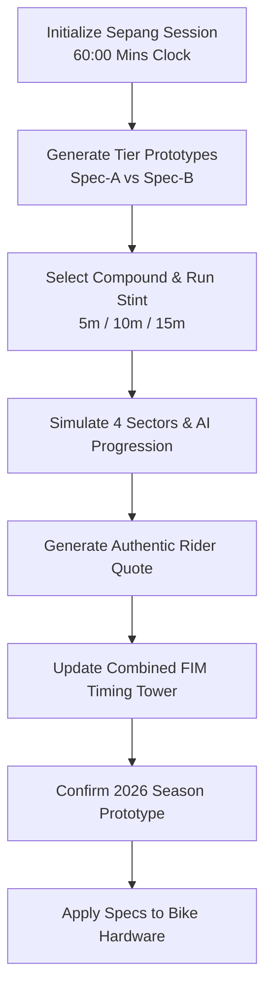
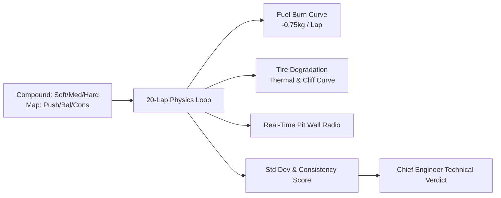

# Module 06: Pre-Season Testing & Long-Run Telemetry Simulation

This module details the **Official Sepang Pre-Season Testing Engine** and the **20-Lap Race Distance Simulation**, featuring multi-compound degradation physics, fuel burn dynamics, prototype branch selection, and telemetry radio debriefs.

---

## 📁 File Structure

```
src/
├── systems/
│   ├── PreSeasonTestSystem.js   # Prototype generation, time-budget stints, Sepang test timing tower
│   └── LongRunSimSystem.js      # 20-lap race distance physics, fuel curves, tire cliffs, radio debriefs
└── ui/
    ├── PreSeasonTestView.js     # Sepang timing screen modal UI & stint launcher
    └── LongRunSimView.js        # Telemetry graphs, lap breakdown table, Chief Engineer report modal
```

---

## ⏱️ 1. Official Sepang Pre-Season Test Engine (`PreSeasonTestSystem.js`)

In Week 1 of the calendar, teams travel to Sepang International Circuit (Malaysia) for the official FIM pre-season test session.



### A. Prototype Engineering Branches per Tier
The system generates two competing development philosophies for the upcoming championship:

#### Tier 1 & 2 (Moto3)
- **Spec-A (Velocity & Aero Wing Evo)**:
  - *Focus*: Straight-line top speed down Sepang's twin 900m straights.
  - *Bonuses*: $+6$ HP, $+12$ Aero Downforce, $+8\text{ km/h}$ Top Speed, $+2$ Chassis, $+2$ ECU.
  - *Wear Index*: Medium-High ($1.15\times$).
  - *Advantage*: Sectors 1 & 4.
- **Spec-B (Agile Mechanical Grip Chassis)**:
  - *Focus*: Cornering speed through high-speed sweepers and gentle tire wear in tropical heat.
  - *Bonuses*: $+2$ HP, $+4$ Aero, $+14$ Chassis Grip, $+6$ ECU Intelligence, $+5\%$ Reliability.
  - *Wear Index*: Low ($0.85\times$).
  - *Advantage*: Sectors 2 & 3.

#### Tier 3 (Moto2)
- **Spec-A (Triumph 765 Ram-Air Aero)**: $+12$ HP, $+18$ Aero, $+10\text{ km/h}$ Top Speed.
- **Spec-B (Boscoscuro Precision Flex)**: $+22$ Chassis Grip, $+10$ ECU, superior front-end tire life.

#### Tier 4 & 5 (MotoGP Premier Class)
- **Spec-A (Desmo Ground-Effect & Launch Spec)**: $+20$ HP, $+25$ Aero, $352+\text{ km/h}$ top speed, high tire wear ($1.20\times$).
- **Spec-B (Cornering Stability & Adaptive ECU)**: $+28$ Chassis Grip, $+20$ ECU, minimal tire consumption ($0.80\times$).

---

### B. Track Stint Execution Math

When running a test stint (`runStint(durationMinutes)`):
1. **Lap Count Calculation**:
   $$\text{TotalLaps} = \max\left(1, \left\lfloor \frac{\text{StintDurationSec}}{\text{TargetBaseSec}} \right\rfloor\right)$$
   Where Sepang base time is $117.7\text{s} \times \text{TierSpeedMultiplier}$.
2. **Compound Offset & Degradation**:
   - Soft: $-0.45\text{s}$ initial pace, $7.5\%$ wear/lap.
   - Medium: $0.00\text{s}$ baseline, $4.5\%$ wear/lap.
   - Hard: $+0.30\text{s}$ pace, $2.8\%$ wear/lap.
3. **Sector Ratio Split**:
   $$\text{S1} = 26\%, \quad \text{S2} = 25\%, \quad \text{S3} = 25\%, \quad \text{S4} = 24\%$$
4. **Dynamic Telemetry Quotes**:
   Authentic rider commentary is generated matching the active prototype and compound:
   > *"The acceleration out of Turn 15 onto the main straight is unbelievable — we are gaining 2 tenths in top speed! But the bike feels a bit heavy changing direction through Turns 5-6."*

---

## 📊 2. 20-Lap Race Distance Simulation (`LongRunSimSystem.js`)

The Long-Run Simulation evaluates machine consistency, thermal tire degradation, and fuel burn dynamics over a full 20-lap race distance.



### A. Physics Models

#### 1. Fuel Burn Acceleration Curve
The bike starts with $16.0\text{ kg}$ of racing fuel. As fuel burns off at $0.75\text{ kg/lap}$, the bike lightens and lap times drop:

$$\Delta_{\text{Fuel}}(\text{Lap}) = -(16.0 - \text{FuelKg}) \times 0.065\text{s/lap}$$

#### 2. Tire Degradation & The "Tire Cliff"
Tires experience two distinct phases of wear:
- **Phase 1 (Linear Thermal Scrub)**: Gradual loss of grip once tire condition drops below $60\%$:
  $$\Delta_{\text{Thermal}} = (60 - \text{TireLife}) \times 0.020\text{s/lap}$$
- **Phase 2 (The Tire Cliff)**: When tire condition drops below the compound's critical cliff point ($\text{CliffWear}$), grip drops exponentially:
  $$\Delta_{\text{Cliff}} = (\text{CliffWear} - \text{TireLife}) \times 0.085\text{s/lap}$$

#### 3. Cold Tire Warm-Up Penalty
On Lap 1, cold tires impose a $+1.40\text{s}$ penalty; on Lap 2, $+0.35\text{s}$.

---

### B. Pit Wall Radio Communication Feed

The simulation logs pit wall messages at strategic intervals:
- **Lap 1**: Out of pit lane confirmation with compound and engine map.
- **Lap 5**: Thermal working window verification and tire temp report.
- **Lap 10**: Rider feedback on fuel lightening and mid-corner balance.
- **Lap 15**: Wear alert (notifying whether the tire is holding or degrading rapidly).
- **Lap 20**: Chequered flag telemetry download notice.

---

### C. Consistency Score & Engineering Verdict

Upon stint completion, the engine calculates standard deviation across all 20 laps:

$$\sigma = \sqrt{\frac{1}{20}\sum_{i=1}^{20} (\text{LapSec}_i - \mu)^2}$$

$$\text{ConsistencyRating} = \max\left(70, \min(99, \text{round}(100 - (\sigma \times 12)))\right)$$

The Chief Race Engineer synthesizes an official technical verdict advising whether the tested compound and map are race-viable:
- **Soft**: Recommended exclusively for Saturday Sprints due to high thermal drop-off.
- **Hard**: Recommended for hot track temperatures (32°C+) where linear wear allows maximum power mapping in the second half of the race.
- **Medium**: The benchmark Grand Prix compromise for balanced pace and durability.
