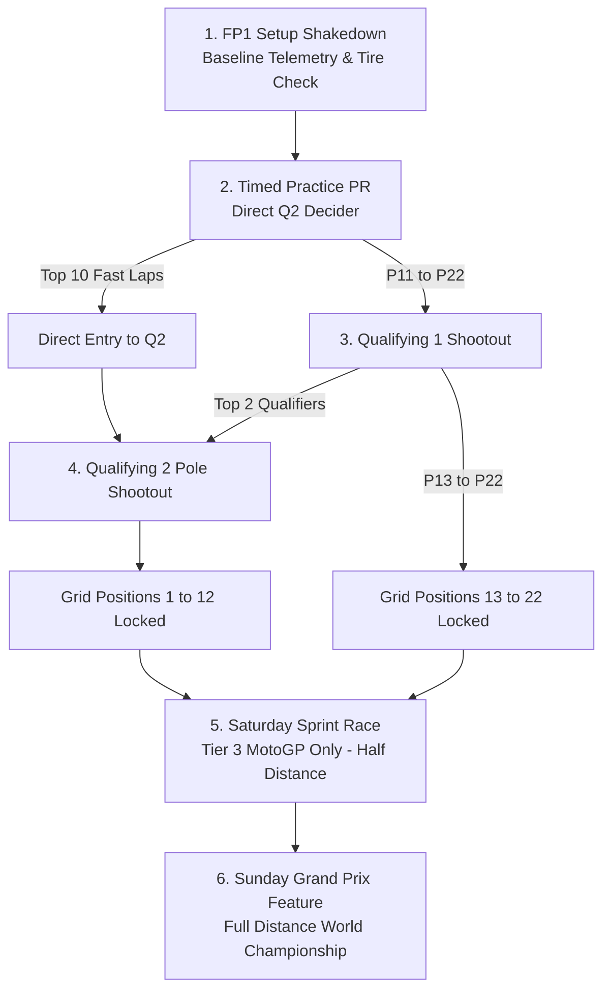
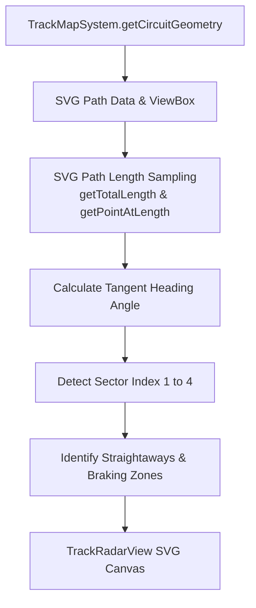

# Module 07: Race Weekend Simulation & 2D Track GPS Radar

This module provides exhaustive technical documentation on the **Race Weekend Pipeline**, the 10Hz live physics loop, FIM flag rules, overtaking and slipstream math, crash dynamics, official championship points distribution, and the authentic **2D SVG Circuit Radar Engine**.

---

## 📁 File Structure

```
src/
├── systems/
│   ├── RaceSystem.js       # Grand Prix weekend lifecycle, live lap simulation, FIM rules, points
│   └── TrackMapSystem.js   # 22 Circuit SVG geometries, tangent vectors, straight/braking zones
└── ui/
    ├── RaceView.js         # Weekend stage controller, timing tower, telemetry table, incident modal
    └── TrackRadarView.js   # Real-time SVG radar canvas, rider dots, slipstream lines, battle markers
```

---

## 🏁 1. Official FIM Grand Prix Weekend Pipeline

The weekend format follows the official 2026 FIM World Championship regulations:



### Session Breakdown
1. **Free Practice 1 (`FP1`)**:
   - Machine setup evaluation. Awards $+60$ Telemetry and $+20$ Spare Parts.
2. **Timed Practice (`PR`)**:
   - High-intensity time-attack. The **top 10 riders advance directly to Q2**. P11 and below must compete in Q1.
3. **Qualifying 1 (`Q1`)**:
   - Shootout between riders ranked P11–P22. The **top 2 transfer to Q2**. Positions 13–22 are locked on the grid.
4. **Qualifying 2 (`Q2`)**:
   - The 12 fastest riders (10 from PR + 2 from Q1) battle for **Pole Position** and front four rows (P1–P12).
5. **Saturday Sprint Race (`SPRINT`)**:
   - Half-distance flat-out sprint race (run exclusively in Tier 3 MotoGP Premier Class). Awards Sprint World Championship points to the top 9 finishers.
6. **Sunday Grand Prix (`RACE`)**:
   - Full-distance main feature race. Points awarded to the top 15 finishers.

---

## 🛞 2. Tire Compounds & Weather Specifications

Tires are managed through `TIRE_COMPOUNDS`:

| Compound | Short | Color | Pace Delta | Wear Rate / Lap | Cliff Point | Strategic Recommendation |
| :--- | :---: | :---: | :---: | :---: | :---: | :--- |
| **Soft** | `SOFT` | 🔴 Red | $-0.35\text{s}$ | $7.5\%$ | $28\%$ | Qualifying time-attack and Saturday Sprints. |
| **Medium** | `MED` | 🟡 Yellow | $0.00\text{s}$ | $4.5\%$ | $22\%$ | Baseline Grand Prix race tire. |
| **Hard** | `HARD` | ⚪ White | $+0.28\text{s}$ | $2.6\%$ | $18\%$ | High track temperature endurance and late-race attack. |
| **Wet Rain** | `WET` | 🔵 Cyan | $+4.20\text{s}$ | $3.8\%$ | $20\%$ | Dedicated Michelin treaded rain tire for wet track conditions. |

---

## ⚡ 3. Real-Time Simulation Loop (`tick(delta)`)

When a race is running (`rs.raceInProgress === true`), `RaceSystem.tick(delta)` executes on every 10Hz engine tick:

### A. Progress Increment Calculation
```javascript
const baseSec = Math.max(70, currentGP.baseSec || 95);
const tierSpeedMult = this.getTierSpeedMultiplier(state.tier);
const targetLapTime = baseSec * tierSpeedMult;

// Progress speed (% per second)
let progressSpeed = (100 / targetLapTime) * (1 + (setupBonus * 0.05));

if (rs.strategy === 'push') progressSpeed *= 1.05;
else if (rs.strategy === 'conserve') progressSpeed *= 0.95;

rs.trackProgress += progressSpeed * delta;
```

### B. Lap Completion & Leaderboard Sorting
When `trackProgress >= 100%`:
1. `trackProgress` resets to $0\%$.
2. Current lap increments: `rs.currentLap += 1`.
3. In `simulateCompletedLap()`:
   - Sector times (S1, S2, S3, S4) are synthesized for every rider.
   - Tire degradation is applied based on engine map and compound wear rates.
   - Crashes and mechanical failures are evaluated based on aggression and consistency.
   - Standings are sorted by total accumulated race time.
   - Gaps to leader (`gapSeconds`) are computed.
   - Live telemetry is saved into `rs.lapHistory`.

---

## 🚩 4. FIM Flag System & Race Incidents

The game features an authentic FIM Marshaling and Flag system:

| Flag Status | Color | Trigger Cause | Simulation Effect |
| :--- | :---: | :--- | :--- |
| **GREEN** | 🟢 | Track clear. | Full racing pace permitted across all sectors. |
| **YELLOW** | 🟡 | Single-rider or multi-bike crash in a specific sector. | Overtaking strictly prohibited in the affected sector. Lap times slow by $+1.2\text{s}$. Flag persists for $1–2$ laps. |
| **RED** | 🔴 | Severe multi-bike accident (3+ DNFs) or extreme track blockage. | Race is stopped immediately. Grid restarts from current running order with remaining laps. |
| **WHITE CROSS** | ⚪❌ | Rain drops detected on dry track (Flag-to-Flag). | Alerts player to prepare for a bike swap in pit lane to change to wet rain tires. |

### Mid-Race Strategic Choice Prompts
During critical events (sudden rain, safety car periods, worn tires), `rs.activeIncident` prompts the player with immediate tactical decisions:
- **Rain Shower Dilemma**: Box for Wet Bike (guarantees wet pace but costs 22s pit stop) vs Stay Out on Slicks (gamble on rain stopping).
- **Aggressive Attack into Turn 1**: Dive down the inside (high chance of gain, small crash risk) vs Hold Position.

---

## 🏆 5. Official FIM Championship Points Tables

Points are awarded according to official FIM World Championship regulations:

| Position | Grand Prix Main Race | Saturday Sprint Race |
| :---: | :---: | :---: |
| **P1** | 25 pts | 12 pts |
| **P2** | 20 pts | 9 pts |
| **P3** | 16 pts | 7 pts |
| **P4** | 13 pts | 6 pts |
| **P5** | 11 pts | 5 pts |
| **P6** | 10 pts | 4 pts |
| **P7** | 9 pts | 3 pts |
| **P8** | 8 pts | 2 pts |
| **P9** | 7 pts | 1 pt |
| **P10** | 6 pts | 0 |
| **P11** | 5 pts | 0 |
| **P12** | 4 pts | 0 |
| **P13** | 3 pts | 0 |
| **P14** | 2 pts | 0 |
| **P15** | 1 pt | 0 |

---

## 🗺️ 6. 2D Circuit Geometry & GPS Radar Engine

`TrackMapSystem.js` contains true-to-life 2D SVG vector path geometries for all **22 Grand Prix circuits**.



### Key Technical Properties per Circuit
- `path`: Scalable SVG path string drawing the exact circuit layout.
- `viewBox`: Aspect ratio bounding box (e.g. `'0 0 1020 520'`).
- `sectors`: Fractional path length splits (`[0.24, 0.50, 0.75, 1.00]`).
- `straightZones`: Array of normalized progress ranges `[[start, end], ...]` where top speed draft slipstreaming occurs.
- `brakingZones`: Normalized coordinates where heavy carbon-braking dive overtakes occur.
- `startFinish`: Exact coordinates $(x, y)$ and heading angle of the start/finish line.
- `turns`: Array of labeled turn markers with coordinates.

### Point-on-Circuit Calculation (`getPointOnCircuit`)
To position a rider at progress $T \in [0.0, 1.0]$:
```javascript
const totalLength = pathEl.getTotalLength();
const curLength = ((progress % 1.0) + 1.0) % 1.0 * totalLength;
const pt = pathEl.getPointAtLength(curLength);

// Tangent sample for bike rotation angle
const delta = Math.min(2.0, totalLength * 0.002);
const nextPt = pathEl.getPointAtLength((curLength + delta) % totalLength);
const angleDeg = (Math.atan2(nextPt.y - pt.y, nextPt.x - pt.x) * 180) / Math.PI;
```

### Real-Time Radar Visual Features (`TrackRadarView.js`)
- **Rider Position Dots**: Colored dots positioned along the track path according to gap seconds from the leader.
- **Slipstream Drafting Lines**: When a chasing rider is within **0.45s** of a rival on a straight zone, an animated cyan slipstream connection line links the bikes.
- **Braking Zone Battle Markers**: When two riders are separated by less than **0.20s** approaching a designated braking zone, a flashing clash marker (`⚔️ P1 vs P2`) illuminates.
- **Accident Caution Flags**: If a rider crashes, their marker is locked at the accident site with a red crash marker, and the corresponding sector flashes in yellow flag caution.
