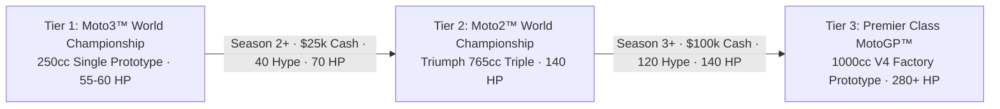

# Module 08: Category Promotion & Legacy Rebirth

This module documents the **Category Promotion Ladder** (Moto3™ to Moto2™ to Premier Class MotoGP™), prize money structures, sponsor multiplier scaling, and the **Legacy Rebirth Prestige System** with permanent Heritage perks.

---

## 📁 File Structure

```
src/
└── systems/
    ├── PromotionSystem.js   # Tier specifications, promotion requirements, category step-up logic
    └── PrestigeSystem.js    # Rebirth trigger, Heritage Token formula, permanent prestige perks
```

---

## 🏆 1. Grand Prix Category Promotion Ladder (`PromotionSystem.js`)

Teams embark on their journey in Tier 1 (Moto3) and can earn promotions to higher FIM world championship classes by building reputation, technical horsepower, and financial capital.



### Full Tier Specifications & Economics (`TIERS`)

| Attribute | Tier 1: Moto3™ | Tier 2: Moto2™ | Tier 3: Premier Class MotoGP™ |
| :--- | :--- | :--- | :--- |
| **Category** | `moto3` | `moto2` | `motogp` |
| **Bike Machinery** | 250cc 4-Stroke Single Cylinder | Kalex Triumph 765cc Triple | 1000cc V4 Factory Prototype |
| **Base Engine HP** | 60 HP | 140 HP | 280 HP |
| **Saturday Sprint Races** | ❌ No | ❌ No | ✅ Yes (Full FIM Sprint Program) |
| **Promotion Capital Cost** | Free (Starting tier) | $25,000 | $100,000 |
| **Min Season Required** | Season 1 | Season 2 (Completed Season 1) | Season 3 (Completed Moto2) |
| **Min Fan Hype Required** | 0 Rep | 40 Rep | 120 Rep |
| **Min Engine HP Required** | 0 HP | 70 HP | 140 HP |
| **GP Win Prize Money** | $1,800 | $6,500 | $25,000 |
| **GP Podium Prize Money** | $1,000 | $3,800 | $15,000 |
| **GP Top-10 Prize Money** | $500 | $1,800 | $8,000 |
| **Sprint Win Prize Money** | N/A | N/A | $10,000 |
| **Sprint Podium Prize** | N/A | N/A | $6,000 |
| **Sprint Top-9 Prize** | N/A | N/A | $3,000 |
| **Sponsor Cash Multiplier**| $1.0\times$ | $3.5\times$ | $10.0\times$ |

### Promotion Execution (`promoteTeam()`)
When all requirements are validated:
1. `state.cash` is deducted by `promotionCost`.
2. `state.tier` and `state.tierName` update.
3. `state.bike.powerHP` is elevated to the category baseline:
   ```javascript
   state.bike.powerHP = Math.max(state.bike.powerHP, next.baseHP);
   ```
4. `RaceSystem.initChampionshipStandings(true)` re-initializes championship standings for the new class roster.
5. Calendar race stage resets to `'FP1'` for Round 1 of the new championship.

---

## 🏛️ 2. Legacy Rebirth & Prestige System (`PrestigeSystem.js`)

When a player reaches high reputation and season points, they can perform a **Legacy Rebirth** (Prestige).

### A. Heritage Token Calculation Formula
The number of pending Heritage Tokens (HT) awarded upon rebirth is calculated in `PrestigeSystem.getPendingHeritageTokens()`:

$$\text{HeritageTokens} = \left\lfloor (\text{FanHype} \times 0.20) + (\text{CurrentTier} \times 3) + (\text{SeasonPoints} \times 0.05) \right\rfloor$$

*Example*:
- Hype: $150$ Rep ($150 \times 0.20 = 30$)
- Tier: $3$ (MotoGP) ($3 \times 3 = 9$)
- Championship Points: $240$ ($240 \times 0.05 = 12$)
- Total Tokens Awarded: $30 + 9 + 12 = \mathbf{51\text{ HT}}$.

---

### B. What Resets vs. What Persists

| Resets to Factory Defaults | Persists Permanently Across Rebirths |
| :--- | :--- |
| Budget Cash ($500) | Accumulated Heritage Tokens (HT) |
| Standard Producers & Machines | Unlocked Heritage Perks (`heritagePerks`) |
| Regular R&D Tech Tree Nodes | Total Prestige Resets Counter (`totalPrestigeResets`) |
| Lead Rider Attributes & Levels | Lifetime Achievement Statistics |
| Hired Pit Crew Staff Levels | |
| Season Calendar Week Index (Week 1) | |

---

### C. Permanent Heritage Perks Catalog (`HERITAGE_PERKS`)

Heritage Tokens can be spent in the Legacy Shrine to purchase permanent game-altering bonuses:

| Perk ID | Name | Icon | HT Cost | Permanent Advantage |
| :--- | :--- | :---: | :---: | :--- |
| `heritage_paddock_brand` | Iconic Brand Power | 👑 | 1 HT | **Doubles (2x)** all commercial sponsor cash revenue and race prize purse winnings permanently. |
| `heritage_fast_rnd` | Factory R&D Heritage | 🧪 | 2 HT | **Doubles (2x)** Research Points (RP) generation speed permanently across all playthroughs. |
| `heritage_legendary_engineer` | Legendary Chief Engineer | 👨‍🔧 | 3 HT | Start all future playthroughs with **+20 Engine HP** and **+15 Aero Downforce** already pre-installed on Day 1. |
| `heritage_telemetry_supercomputer`| Paddock Quantum Server | 🖥️ | 5 HT | Permanently expands maximum Telemetry data storage capacity by **+500 Telemetry**. |

### Rebirth Execution Code (`performPrestige()`)
```javascript
static performPrestige() {
    if (!this.canPrestige()) return false;

    const state = gameState.getState();
    const pendingHT = this.getPendingHeritageTokens();
    const totalHT = state.heritageTokens + pendingHT;
    const savedPerks = [...state.heritagePerks];
    const resets = state.totalPrestigeResets + 1;

    // Reset state to initial schema
    const newState = JSON.parse(JSON.stringify(INITIAL_STATE));
    newState.heritageTokens = totalHT;
    newState.heritagePerks = savedPerks;
    newState.totalPrestigeResets = resets;

    // Apply active perk bonuses
    if (savedPerks.includes('heritage_legendary_engineer')) {
        newState.bike.powerHP += 20;
        newState.bike.aeroDownforce += 15;
    }
    if (savedPerks.includes('heritage_telemetry_supercomputer')) {
        newState.telemetryMax += 500;
    }

    gameState.setState(newState);
    gameState.addLog(`🏆 LEGACY REBIRTH COMPLETED! Gained +${pendingHT} Heritage Tokens.`);
    return true;
}
```
